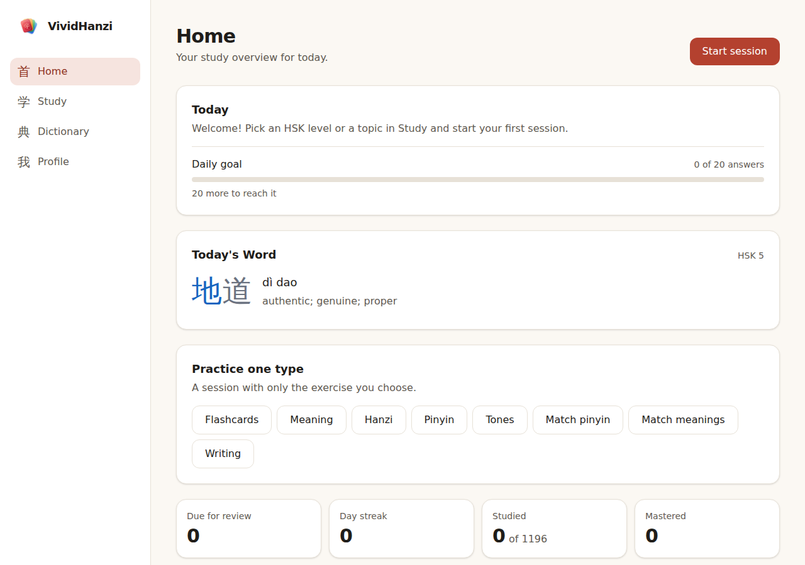
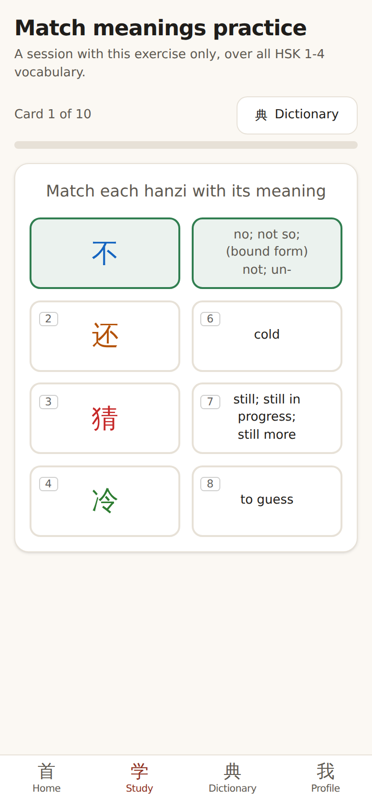
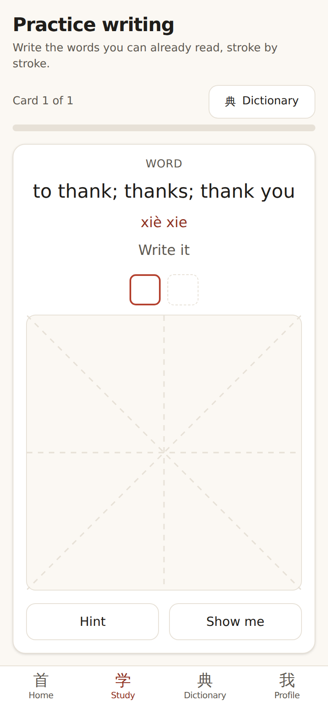
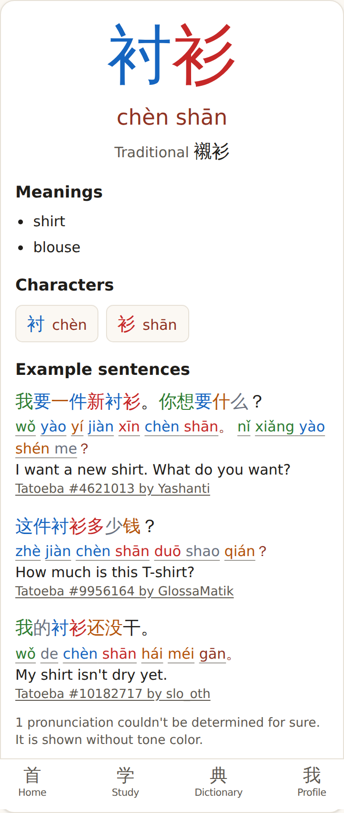
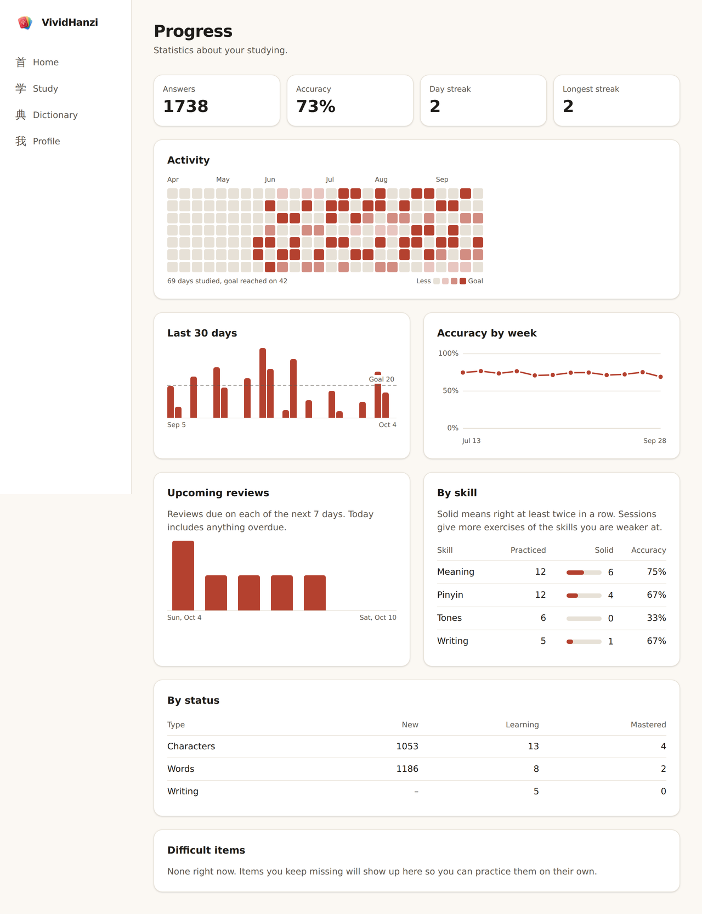

# VividHanzi

**A free, open-source web app for learning Chinese characters and vocabulary.**
Spaced repetition, stroke-by-stroke writing practice, tone-colored pinyin and a
full Chinese-English dictionary, in a clean interface that works on desktop and
phone.

**Try it: [vividhanzi.com](https://vividhanzi.com)** · no account needed, no ads.

[](LICENSE)
[](https://ko-fi.com/cogo8)

<p>
  
  
</p>
<p>
  
  
  
</p>

## Features

- **HSK 1-4 vocabulary** (about 1,200 words) plus 17 hand-picked topic sets and
  your own custom sets. Import a set from a word list, a CSV or JSON.
- **Learn, then review.** New words are introduced one by one; you can mark
  the ones you already know or skip the ones you don't want to learn.
- **Spaced repetition** decides when each word comes back. Sessions start with
  what is due and give more exercises for your weaker skills (meaning, pinyin,
  tones, writing).
- **Many exercise types:** flashcards, meaning, hanzi, pinyin, tones, match
  pinyin, match meanings and writing.
- **Writing practice** stroke by stroke with hints, sized for phones.
- **Full dictionary** (CC-CEDICT, about 118,000 entries): stroke order
  animation, radicals, components, etymology and example sentences where every
  word is tappable.
- **Grammar notes** for 30 common particles and patterns, with examples.
- **Tone colors** for hanzi and pinyin, **dark mode**, installable as an app
  on your home screen.
- **Progress:** daily goal, activity calendar, streaks, accuracy charts,
  per-skill stats, difficult words and a Today's Word card (HSK 3-5).
- **Your data stays yours.** Progress is saved in your browser. Optionally
  sign in (Google or an email link) to sync it across devices.

## Support the project

VividHanzi is free and has no ads or paid tier. If it helps you learn, you can
[buy me a coffee on Ko-fi](https://ko-fi.com/cogo8). Bug reports, ideas and
pull requests are just as welcome.

## Contributing

Issues and pull requests are welcome. Read
[`CONTRIBUTING.md`](CONTRIBUTING.md) for how to set up the project, the
conventions and what to check before opening a pull request.

## Running it locally

Requires Node.js 20.19 or later (22 recommended).

```bash
npm install
npm run dev        # development server at http://localhost:5173
```

Without a Supabase project configured the app works the same, just without
accounts. See [`docs/ACCOUNTS.md`](docs/ACCOUNTS.md).

| Command | What it does |
| --- | --- |
| `npm run dev` | Development server with hot reload |
| `npm run build` | Type-checks and builds the production version into `dist/` |
| `npm run preview` | Serves the production build locally |
| `npm run typecheck` | Type-check only |
| `npm run lint` | Linter (oxlint) |
| `npm test` | Runs the tests once |
| `npm run test:watch` | Tests in watch mode |
| `npm run check` | Types + lint + tests (the same thing CI runs) |
| `npm run data:fetch` | Downloads the dataset sources (HSK list, CC-CEDICT, Unihan, Make Me a Hanzi, Tatoeba) |
| `npm run data:build` | Regenerates the dataset in `src/data/`, `public/strokes/` and `public/examples/` (see `docs/DATA_SOURCES.md`) |
| `npm run data:validate` | Validates the generated dataset without downloading anything |

## Tech stack

React 19 · TypeScript (strict) · Vite · Tailwind CSS v4 · React Router ·
Hanzi Writer · Supabase (optional sync) · Vitest + Testing Library · oxlint.
Hosted on GitHub Pages.

## Project structure

```
docs/            Architecture, data sources, accounts and screenshots
scripts/dataset/ Script that generates the dataset from the sources
public/          Static files: icons, stroke data and example sentences for HSK
supabase/        Database schema for the optional account sync
src/
  app/           App shell, routes and navigation
  pages/         One page per app section
  features/      Domain logic and components (practice, srs, progress, dictionary,
                 grammar, sync, ...); logic is plain TypeScript, tested without React
  data/          Generated dataset (HSK 1-5, topic sets, grammar notes)
  lib/           Domain-free utilities (pinyin, dates, storage)
  components/ui/ Shared visual pieces
  i18n/          Interface texts and the t() function
```

How it fits together is in [`docs/ARCHITECTURE.md`](docs/ARCHITECTURE.md).

## Data and credits

All linguistic data comes from open sources and is generated with a script;
nothing is written by hand or by AI. Thanks to the people behind them:

- Meanings, readings and traditional forms: [CC-CEDICT](https://cc-cedict.org/wiki/) (CC BY-SA 4.0).
- HSK 2.0 word lists: [clem109/hsk-vocabulary](https://github.com/clem109/hsk-vocabulary) (MIT).
- Radicals and traditional forms of characters: [Unihan](https://www.unicode.org/reports/tr38/) (Unicode License v3).
- Components and etymology: [Make Me a Hanzi](https://github.com/skishore/makemeahanzi) (LGPL 3.0+).
- Stroke order and stroke count: [hanzi-writer-data](https://github.com/chanind/hanzi-writer-data) (Arphic Public License).
- Example sentences: [Tatoeba](https://tatoeba.org) (CC BY 2.0 FR).
- Word frequency: [wordfreq](https://github.com/rspeer/wordfreq) (data CC BY-SA 4.0).
- Grammar notes are original explanations; the
  [Chinese Grammar Wiki](https://resources.allsetlearning.com/chinese/grammar/)
  is linked as further reading, not copied.

Details on versions and which source owns each field are in
[`docs/DATA_SOURCES.md`](docs/DATA_SOURCES.md).

## License

The source code is released under the [MIT License](LICENSE).

The linguistic data is not covered by the MIT License: each data file keeps
the license of its source (see above). In particular, the word and character
data derived from CC-CEDICT and wordfreq is shared under CC BY-SA 4.0, the
example sentences under CC BY 2.0 FR and the stroke data under the Arphic
Public License.
